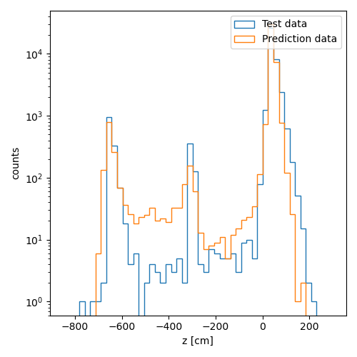
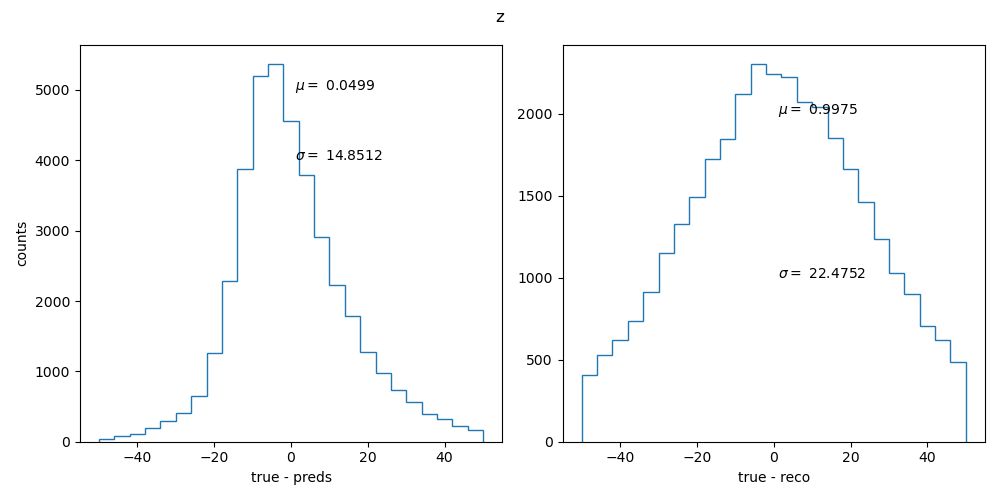

# VertexML

A machine learning approach to find the vertex information of the reconstructed tracks.


## Data Creation
Raw data was created using the [`SimChainDev`](https://github.com/E1039-Collaboration/e1039-analysis/tree/master/SimChainDev) of the `e1030-analysis` framework. Raw data contains `~200k` Drell-Yan events with $\mu^{+/-}$ particles and you can find it in the `data/raw` directory. The structure of the input data is;
```
X = [charge, station1[x, y, z], station1[x, y, z], station3[px, py, pz], station3[px, py, pz]]
y = [vertex[x, y, z, px, py, pz]
```

### Testing This Module

It is highly recommended to use the [`conda`](https://github.com/conda-forge/miniforge) environment to test this module.
```bash
git clone https://github.com/dinupa1/vertexML.git
cd vertexML
conda env create -f environment.yml
conda activate vertexML
```

You can run the `vertexml.ipynb` as an example.



